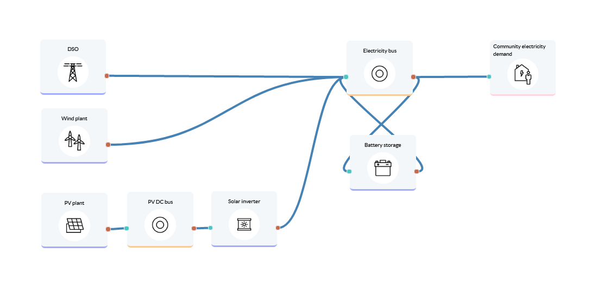

Electricity supply to community
===============================

A community of 3,000 residents wants to determine how they can increase the self-sufficiency of their electricity supply. PV and wind as renewable sources are considered, and battery storage.
Lifetime: 20 years

