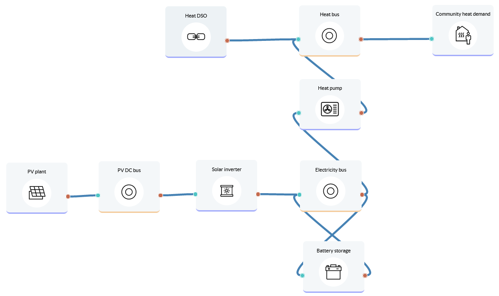

Heat supply to community
====================

A community of 3,000 residents wants to determine how they can increase the self-sufficiency and renewable share of their heat supply.
Lifetime: 20 years

