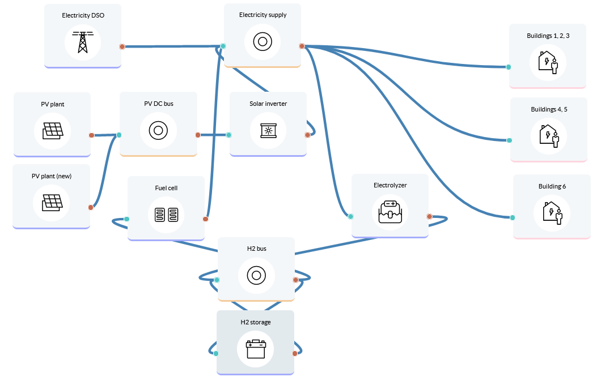

Hydrogen production for a technology park
=========================================

A technology park considers locally producing hydrogen from excess PV generation, either for using as a means of electricity storage or for external sales.
Lifetime: 20 years

