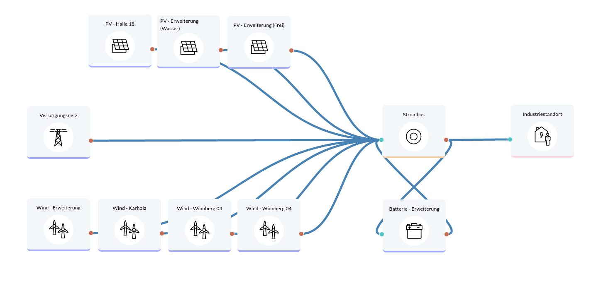

Industrial site Max Bögl
========================

An industrial site with an annual electricity consumption of 26 GWh and a peak load of 6.3 MW is aiming to increase its self-sufficiency rate and reduce its grid connection power by expanding PV, wind power and a battery. This is shown in four different scenarios.
Lifetime: 20 years

