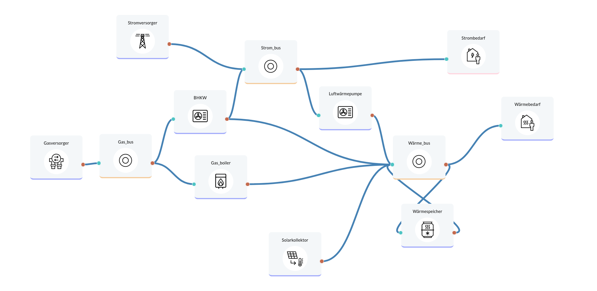

Sector coupling for apartment building
====================

Optimization of an apartment building (approx. 20 apartments) near Konstanz with the following data: 70,000 kWh/year electricity consumption BDEW H0 profile 286,000 kWh/year heat consumption (heating + hot water) modeled by outdoor temperature according to BDEW. Weather data from German weather service for Constance 2018. Cost data for components largely from Danish technology catalog.
Lifetime: 20 years

