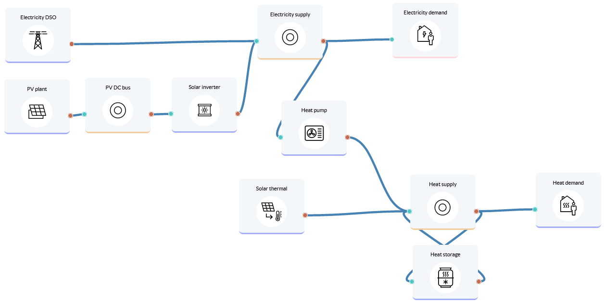

Sector coupling for office building
===================================

An office building aims to improve the sustainability, overall efficiency and flexibility of its energy system by introducing renewables and considering sector coupling for electricity and heat.
Lifetime: 20 years

