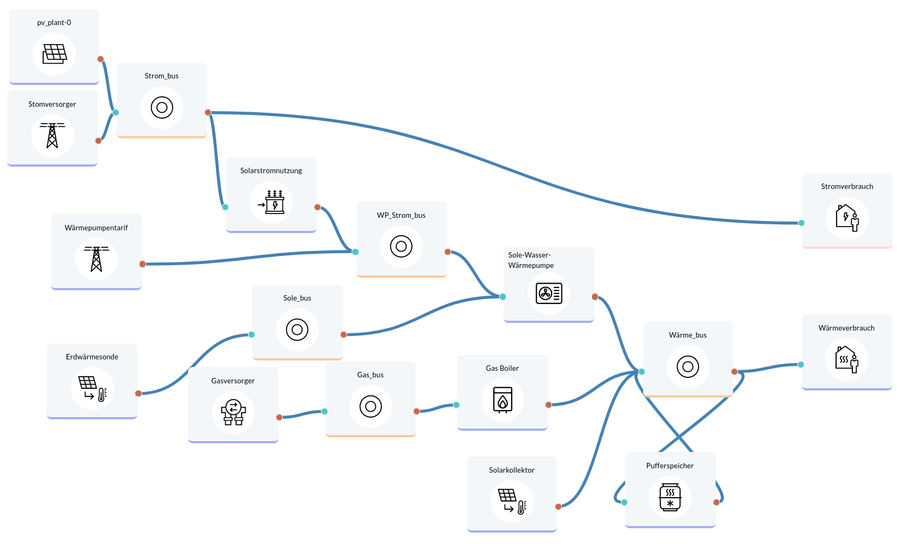

Sector coupling for single household
====================================

Optimization of the home supply near Constance for a single family house with the following data: 3500kWh/year electricity consumption BDEW h0 profile 28600kWh/year heat consumption (heating + hot water) modeled by outdoor temperature according to BDEW. Weather data from German weather service for Konstanz 2018. Cost data for components largely from Danish technology catalog. Assumed roof pitch of 30° with south orientation for solar collector and PV modules.
Lifetime: 20 years

