===========
Quick start
===========

First steps
-----------

Create an account
^^^^^^^^^^^^^^^^^
The first step to start using open-plan-tool is to create an account. To do this, you must click on the "Sign up" button at the top right corner and fill in the following information: your name, email address, username and password. Finally, do not forget to read and accept the privacy statement. You should receive an email with a link to confirm the account creation. You can find our privacy policy `here <https://open-plan.rl-institut.de/en/privacy/>`_.


Explore the dashboard
^^^^^^^^^^^^^^^^^^^^^

When you log in, the following dashboard is displayed. In the following image the points described below are labeled with numbers and letters.

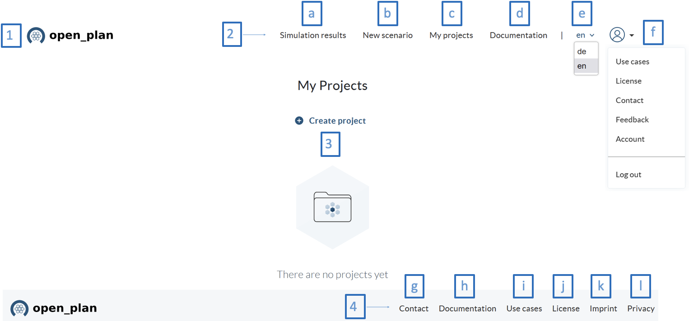

**1. Logo. Clicking here will take you back to the home screen and your projects. Here you find all the projects you have created, and you can create new projects.**

**2. Top navigation menu. Located on the upper right part of the screen, here you will find the shortcuts to:**

    a) Documentation. Key information so that you can get to know the tool and develop your projects.
    b) Use cases. Here you will find some use cases where the functionalities of the system and its application in different projects and scenarios are presented.
    c) We are happy to hear about your experience with open_plan, so feel free to share your questions, comments and suggestions here.
    d) Change the language. English (en) and German (de) are supported.
    e) Profile drop-down options.
**3. Dashboard. Here is the link to create a new project or the list of current projects when they already exist.**

**4. Bottom navigation menu. Located at the bottom right of the screen. Here you will find:**
    g) Contact. General information about the project, a section where you can leave your feedback and find the link to GitHub, where you can follow the development or find useful information related to how to host the tool by yourself.
    j) License. You can find the license information here.
    k) Imprint. Important information about the tool and some disclaimers are in this section.
    l) Privacy. Information on data protection, data processing and the legal and policy issues around them.


Create a project
^^^^^^^^^^^^^^^^

To create a project in open-plan-tool, the user has three options:

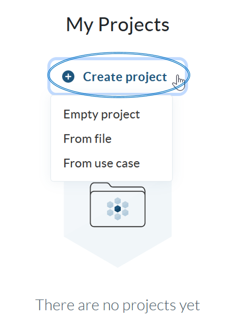

:Empty project:
Here a project is created from scratch. When you select this option you must configure your project and for that you must include the following information: 

- Name

- Description

- Country

- Location (coordinates)

- Duration (years)

- Currency

- Discount factor


:From file:
It is also possible to load a project from a file. In this case you must include the name of the project and upload the file in json format. This option makes it possible to share projects among each other.

:From use case:
If you want to start from one of the configured use cases, you can do so in this option. You will see a pop-up window with a link to the use cases, and a drop-down list where you can choose the use case to use. Once selected, it will appear in the "My projects" section.


Create a scenario
^^^^^^^^^^^^^^^^^

Once the project is created, it is possible to create various scenarios within the project. To do this, you have two options: you can create a new scenario by defining all its parameters or you can load a previously created scenario from a json file. So here there is also the option to share scenarios among each other. 

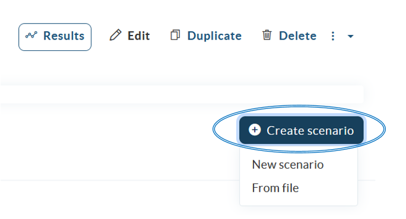

When creating a scenario from scratch, there are four steps to go through:

1) Scenario setup
2) Energy system design
3) Constraints
4) Simulation.

At the top you will see the name of the project (in bold type), the name of the scenario, the four steps for scenario creation, and an identifier which step you are in.


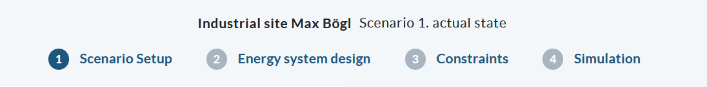

Below is a brief description of what should be done at each step.


**1) Scenario setup**


The setup consists of assigning a name to the scenario, its corresponding description, the evaluated period (number of days) the simulation will run, the length of the time steps of the simulation in minutes, the start date (keep in mind that this date is important for getting the data from the time series and for plotting the data) and the fixed project costs which include the planning and development costs of the project.


**2) Energy system design**

In this section the energy system will be designed using different components, which are located on the left panel and classified in different categories: **Providers, Production, Conversion, Storage, Demand and Bus.** ```
In the graphic panel drag the components you need to design your energy system and do not forget to include the buses. Note that assets are connected to each other using a bus which is the identifier for the energy carrier (e.g. electricity or heat). Interconnecting two buses or two assets directly is not allowed. Connect the components together using the green and red terminals. The green terminals represent inputs, while the red terminals represent outputs, see the following example:

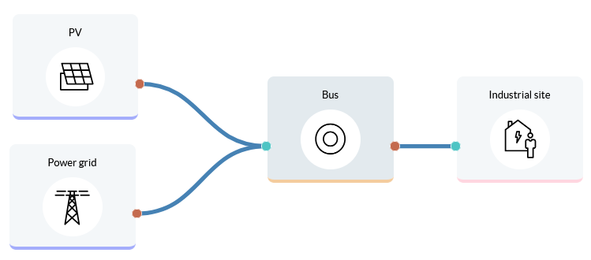


The components representing **battery energy storage systems (BESS)** have been defined with one input and one output. The BESS can be connected directly to the electrical bus; please note that the bus is supplied and feeds the battery at the same time.

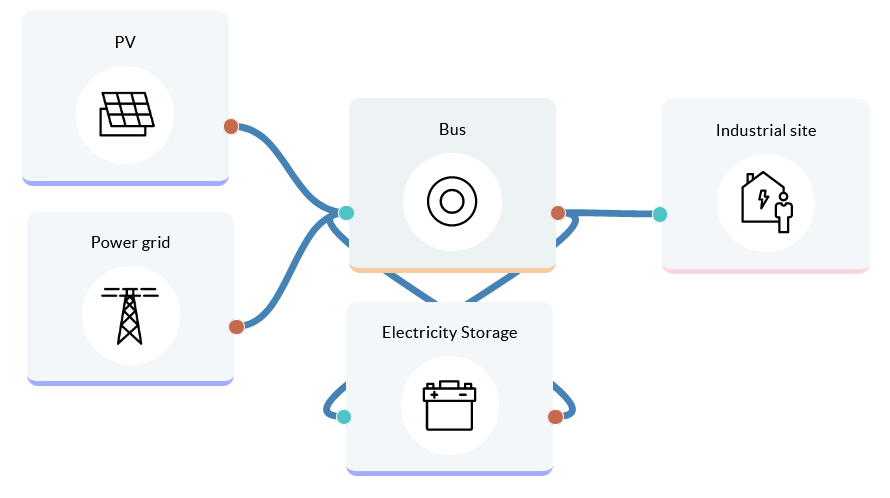


When you click on the components, a screen appears where you can configure the different parameters. The input parameters are different for each component category, however, you will typically find three ways to complete the information: spaces to enter values, drop-down lists with default information or buttons to load time series (in this case, a graph will be displayed where the loaded data series can be previewed). The input field for the components that belong to one category (e.g. the conversion components) contains usually the same parameters, but there are also components that may differ slightly, such as the heat pump. Below we show you as an example some of the component setup screens.


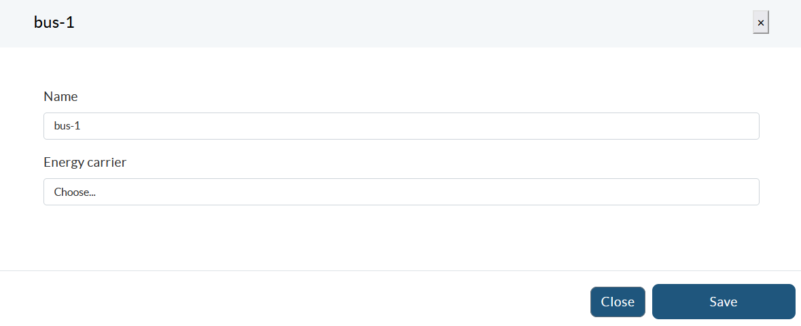


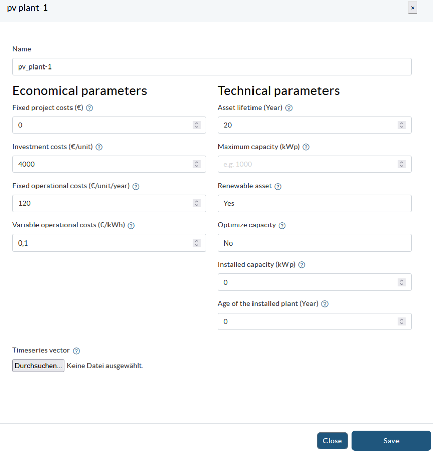


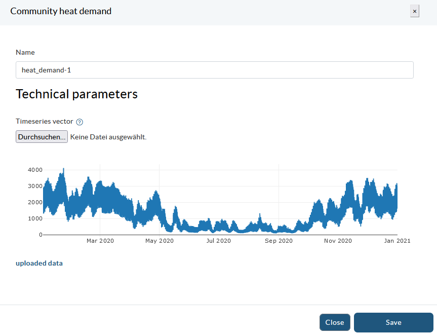


Before proceeding to the next section, be sure to complete the information requirements for each component and save the energy system.


**3) Constraints**

In the third section system-wide constraints can be set. At the moment two constraints, the degree of autonomy and the share of renewables, are implemented:


	- **Degree of autonomy:** This constraint is a lower boundary for the degree of autonomy of the energy system. The factor can take values between 0 and 1, with the value close to zero showing a degree of autonomy with high dependence on the energy supplier, while a degree of autonomy of 1 represents a fully autonomous energy system.


	- **Share of renewables:** This constraint is a lower boundary for the renewable share of the energy system, where both local generation as well as the renewable share of the generation mix supplied by the energy providers are taken into account. 
	
Within each constraint you can decide whether to activate it or not, and in case of activation set a value that must be met by the system.


**4) Simulation**

Once the scenario parameters are set, you proceed to the simulation panel. At the bottom you will find the button to run the simulation.

Once the simulation is done you get the results of your scenario by clicking on the button **Check results dashboard.**

Further you can select the option whether you want to include an LP file. With the LP file you can look the mathematical formulation consisting of objective function and constraints. It is recommended to choose a small number of days to evaluate (e.g. one day) to keep the LP file readable. After running the simulation you can download the LP file and open it in a text editor.

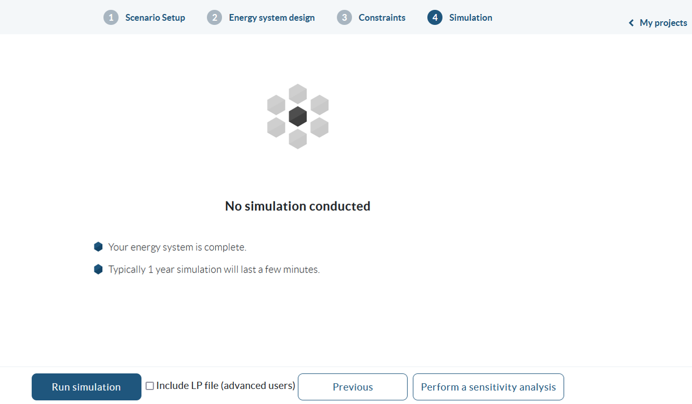


Simulation results
^^^^^^^^^^^^^^^^^^

In the **results dashboard** you can have a detailed look at the results of your scenarios. When pressing the button you are automatically in the currently simulated scenario, but you can select another project [1] or scenario [2]. Only scenarios that have already been simulated are displayed.

In the upper right part you have the possibility to download all timeseries of the scenario including given timeseries and simulation results, the resulting Key Performance Indicators (KPIs), and the component costs as Excel files [3]. Further you can return to the scenario setup [4].

To view the most relevant results directly, you have the three options: **single scenarios, compare scenarios and sensitivity analysis [5].** Please note that the option of sensitivity analysis is not fully implemented yet. At the moment you get an error as soon as you click the button. We proceed working on this feature in the future.

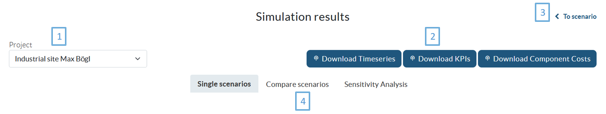

:Single scenarios:

This option makes it easy to view the results of one scenario at a time. On the left is a drop-down menu where the scenario is selected (a) and on the right is the option to add a new chart (b).


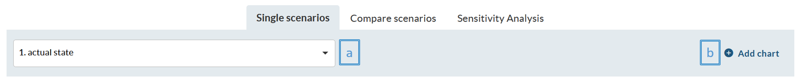

Subsequently, the scenario KPIs will be presented, which include: Degree of Autonomy, Levelized costs of electricity equivalent, Onsite energy fraction, Renewable factor and Renewable share of local generation.

Then, you will be able to visualize the energy system, all its components and connections. Finally, some charts summarizing the results of the scenario are presented, including the overall cost breakdown, the energy series (in KW), the installed and optimized capacity, as well as a Sankey diagram.

Additional charts can be included, as shown in the image above with item b. The charts are interactive, as you can see the value by hovering the pointer over the chart, and there is a menu that appears in the upper right corner of the chart area. Here you can zoom in and out, reset the axes, download the image as .png format, among other options. In the legend of the charts you can select which data series to view or hide with a single click. Tables and charts can be exported in .xls, .pdf format. To do so, you can locate the three dots in the upper right corner of the tables or charts, click on them and select the alternative that suits you best.

:Compare scenarios:

It is also possible to compare the results of multiple scenarios. You only need to include the scenarios to be compared (c). Remember that you can add additional charts if necessary (b).

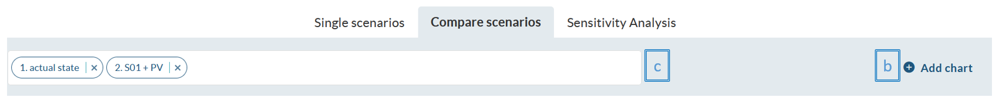

For each scenario, a column with the values will appear in the KPI table. Also, the cost, energy and installed and optimized capacity charts show the values of the scenarios. This facilitates the comparison of the data.

As for the previous option, the charts are interactive, can be adjusted according to your needs, and both the table and the charts can be exported in different formats.

:Sensitivity analysis:

This functionality is not fully implemented yet. At the moment you get an error as soon as you click the button. We proceed working on this feature in the future.


Feedback or Question
--------------------

We are happy to hear about your experience with open-plan-tool, so feel free to share your questions, comments and suggestions `here. <https://open-plan.rl-institut.de/en/user_feedback>`_ We will get back to you as soon as possible.
We also have a FAQ section, your question may already be answered there.
Remember that on the project's GitHub page you can keep track of the developments that are in progress or those that have been completed.

FAQ
---
**To be completed**