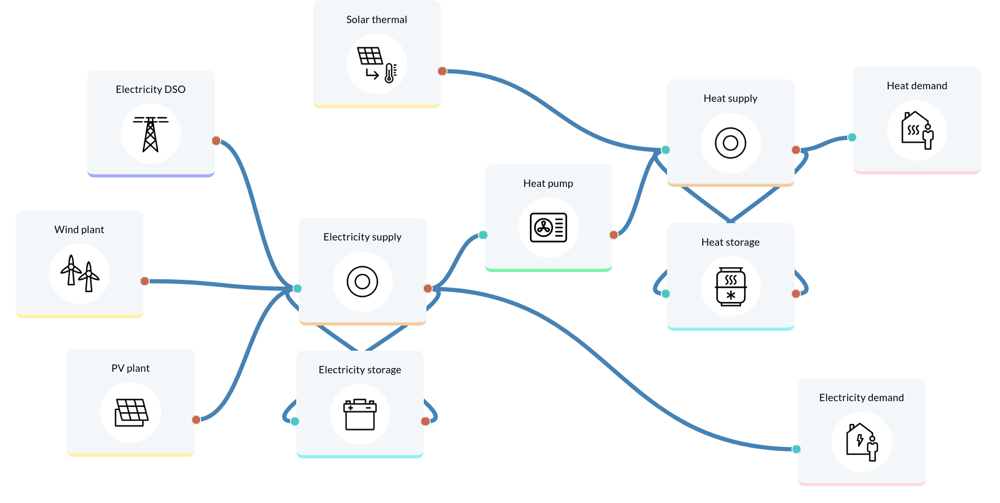

.. ..
..   SPDX-FileCopyrightText: Open Plan Authors

..   SPDX-License-Identifier: CC-BY-4.0

.. _Flowchart:

==============
open-plan-tool
==============

The open-plan-tool is an open-source tool for designing and optimizing multi-energy carriers energy systems and operational strategies for the supply of neighborhoods, industrial parks and industries.

Its versatility allows you to create different projects and scenarios. You will be able to evaluate different cases and compare results between scenarios with just a few clicks. We also provide you with some use cases that can serve as a reference for your own projects.

Modeling your energy systems has never been so easy before, the tool was developed with a strong focus on easy use without requiring programming language expertise. Using modular components, you can configure your energy system.

You will be asked to provide the required data via individual data, a collection of csv files or a unique JSON file with particular format. The input data is split into the following categories:
Project description, which entails the general information regarding the project (country, coordinates, etc.), as well as the economic data such as the discount factor, project duration, or tax;
System configuration, in which the user specifies the technical and financial data of each asset;
Constrains, are a fundamental part of the definition of the linear problem and describe the degree of autonomy and the share of renewable energies.
This set of input data is then translated to a linear programming problem, also known as a constrained optimization problem. The open-plan-tool is based on the multi-vector simulator (MVS), which in turn is based on the oemof-solph python library, with which a problem is described by specifying an objective function to minimize annual energy supply costs, decision variables and limits and constraints.

The simulation outputs are also separated into categories: KPI indicators, economic results and technical results (that include the optimized capacities and dispatch of each asset). 

Explore what open-plan-tool has to offer:

Online tool: `open-plan-tool <https://open-plan.rl-institut.de/>`_

Publications: `List of publications <https://open-plan-tool.org/publications_en.html>`_

GitHub: `Online Repository <https://github.com/open-plan-tool/>`_

Youtube: `Watch Our Videos <https://www.youtube.com/channel/UCg8NUlNM4m9iT94K3Zf8S2A>`_

The open-plan-tool project consortium is composed of the `Reiner Lemoine Institute (RLI) <https://reiner-lemoine-institut.de/>`_, `German Solar Energy Society [Deutsche Gesellschaft für Sonnenenergie (DGS)] <https://www.dgs-berlin.de/>`_ and the `Potsdam Institute for Climate Impact Research <https://www.pik-potsdam.de/>`_. It is funded within the framework of the "Technology-oriented systems analysis" funding area of the BMWi's 7th Energy Research Programme "Innovation for the energy transition".

The open-plan-tool project complements other previous open-science research projects of RLI, such as open_eGO (OpenEnergyPlatfrom), open_FRED (feed-in time series on OpenEnergyPlatform) and enables the comparison, validation and improvement of energy system modelling.

Maintainers
------------
The open-plan-tool is currently maintained by staff from the `Reiner Lemoine Institute <https://reiner-lemoine-institut.de/>`__ the `Potsdam Institute for Climate Impact Research <https://www.pik-potsdam.de/>`__ and the `German Solar Energy Society <https://www.dgs-berlin.de/>`__.

.. .. only:: html

..     .. image:: https://readthedocs.org/projects/multi-vector-simulator/badge/?version=latest
..         :target: https://multi-vector-simulator.readthedocs.io/en/latest/?badge=latest
..         :alt: Documentation Status

..     .. image:: https://github.com/rl-institut/multi-vector-simulator/workflows/CI/badge.svg
..         :alt: Build status

..     .. image:: https://coveralls.io/repos/github/rl-institut/multi-vector-simulator/badge.svg
..         :target: https://coveralls.io/github/rl-institut/multi-vector-simulator
..         :alt: Test coverage

..     .. image:: https://zenodo.org/badge/DOI/10.5281/zenodo.4610237.svg
..         :target: https://doi.org/10.5281/zenodo.4610237
..         :alt: Zenodo DOI

..     .. image:: https://img.shields.io/badge/License-GPL%20v2-blue.svg
..         :target: https://img.shields.io/badge/License-GPL%20v2-blue.svg
..         :alt: License gpl2

..     .. image:: https://badge.fury.io/py/multi-vector-simulator.svg
..         :target: https://pypi.org/project/multi-vector-simulator/
..         :alt: Pypi version

..     .. image:: https://img.shields.io/badge/code%20style-black-000000.svg
..         :target: https://github.com/psf/black
..         :alt: black linter

.. The open-plan-tool is an `oemof <https:/github.com/oemof>`__ -based Python package which aims at facilitating the modelling of multi-energy carriers energy systems in island or grid connected mode.

.. The main goals of the open-plan-tool are

.. #. to minimize the production costs by determining the generating units' optimal output, which meets the total demand

.. #. to optimize near-future investments in generation and storage assets with the least possible cost of energy.

.. The open-plan-tool graphical model is divided into three connected blocks that trace the logic sequence: inputs, system model, and outputs. This is a typical representation of a simulation model:

.. .. image:: images/MVS_flowchart.png
..  :width: 600

.. The user is asked to provide the required data via a collection of csv files or a unique json file with particular format. The input data is split into the following categories:

.. *	**Project description**, which entails the general information regarding the project (country, coordinates, etc.), as well as the economic data such as the discount factor, project duration, or tax

.. *	**Energy consumption**, which is expressed as times series based on the type of energy (in this case: electrical and thermal)

.. *	**System configuration**, in which the user specifies the technical and financial data of each asset

.. *	**Meteorological data**, which is related to the components that generate electricity by harnessing an existing source of energy that is weather- and time-dependent (e.g. solar and wind power)

.. This set of input data is then translated to a linear programming problem, also known as a constrained optimization problem. The MVS is based on the `oemof-solph <https://github.com/oemof/oemof-solph>`__ python library that describes the problem by specifying an objective function to minimize the annual energy supply costs, the decision variables and the bounds and constraints.

.. The simulation outputs are also separated into categories:

.. * Economic results used for the financial evaluation, such as the levelized cost of electricity/heat or the net present value of the projected investments
.. * Technical results that include the optimized capacities and dispatch of each asset
.. * Environmental results assessing the system’s environmental contribution in terms of CO2 emissions.

.. Additionally, different vizualizations of the results can be provided, eg. as pie charts, plots of asset dispatch and an automatic summary report.

.. toctree::
   :hidden:
   :maxdepth: 2
   :caption: Getting Started

   getting_started/quick_start_guide.rst
   getting_started/installation.rst
   getting_started/basic_structure.rst

..
   getting_started/contact_us.rst
   
.. toctree::
   :hidden:
   :maxdepth: 2
   :caption: Use Cases

   examples/Industrial_site_Max_Boegl.rst
   examples/Electricity_supply_to_community.rst
   examples/Heat_supply_to_community.rst
   examples/Sector_coupling_for_office_building.rst
   examples/Hydrogen_production_for_a_technology_park.rst
   examples/Sector_coupling_for_single_household.rst
   examples/Sector_coupling_for_apartment_building.rst
   
   
.. toctree::
   :hidden:
   :maxdepth: 2
   :caption: Mathematical Description

   getting_started/mathematics_simply_explained.rst

..
    math/math_intro.rst

.. toctree::
   :hidden:
   :maxdepth: 2
   :caption: Model Reference

   model/assumptions.rst
   model/components.rst
   model/constraints.rst
   model/limitations.rst
   model/input_parameters.rst
   model/simulation_outputs.rst

.. Model Reference
.. ===============

.. * **How the energy system is modelled**: :doc:`Assumption behind the model <model/assumptions>` | :doc:`Available components for modelling <model/components>` | :doc:`Setting constraints on model or components <model/constraints>` | :doc:`Scope and limitation of the model <model/limitations>`
.. * **Description of parameters**: :doc:`Input parameters <model/input_parameters>` | :doc:`Output variables and KPIs <model/simulation_outputs>`
.. * **Validation of the model**: :doc:`Validation methodology <model/validation>`

..     .. maybe add Pilot projects here as well?
.. ..
..     release_notes (for website, remove for report, not implemented yet, nice to have)
..     contributing (here paste content of contributing.md --> convert to RST and include it as we did for readme, the mention to contributing in getting started will link to this chapter)
.. API Reference
.. =============

.. * **Documentation**: :doc:`Modules and functions <references/code>`
.. * **Getting involved**: :doc:`Contributing guidelines and protocols <references/contributing>`
.. * **Academic references**: :doc:`Publications and Bibliography <references/publications>`
.. * **Using or modifying MVS**: :doc:`License <references/license>` | :doc:`How to cite MVS <references/citations>`
.. * **Getting help**: :doc:`Know issues and workaround <references/troubleshooting>` | :doc:`Report a bug or issue <references/bug_report>`

.. Indices and tables
.. ==================

.. * :ref:`genindex`
.. * :ref:`modindex`
.. * :ref:`search`

